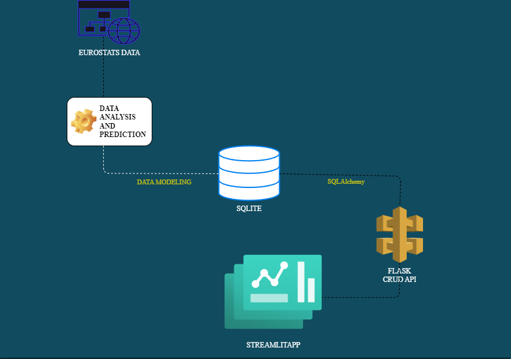
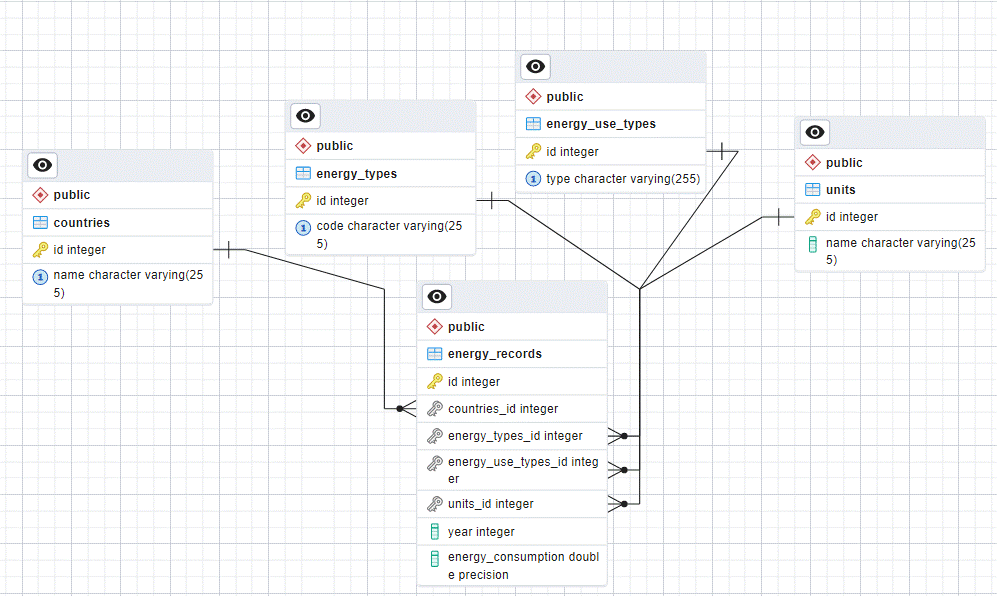

# Energy Data Engineering and Dashboard Project



This repository contains the code for an end-to-end data engineering project focusing on energy consumption. The project includes data modeling, Flask API creation, analysis, missing data prediction, and dashboarding using Streamlit.

## Table of Contents

- [Introduction](#introduction)
- [Project Structure](#project-structure)
- [Requirements](#requirements)
- [Installation](#installation)
- [Usage](#usage)
- [Data Modeling](#data-modeling)
- [Flask API](#flask-api)
- [Data Analysis](#data-analysis)
- [Missing Data Prediction](#missing-data-prediction)
- [Streamlit Dashboard](#streamlit-dashboard)
- [References](#references)

## Introduction

This repository documents our entire journey, starting from extracting, transforming, analyzing and loading data into a specially designed database. We then created a CRUD API using Flask for our data model, storing it in an SQLite database. Following that, we analyzed and predicted missing data using two datasets from the Eurostat's [Disaggregated final energy consumption in households - quantities](https://ec.europa.eu/eurostat/databrowser/view/NRG_D_HHQ/default/table?lang=en) and [Number of households by household composition, number of children and age of youngest child (1 000)](https://ec.europa.eu/eurostat/databrowser/view/LFST_HHNHTYCH/default/table?lang=en) datasets. Finally, we visualized the transformed data using a Streamlit app.

## Project Structure

```.
├── .gitignore                  # File to ignore unnecessary files
├── config.py                   # Configuration file, settings for the project.
├── energy_data_insights_app.py # Script for running the Flask API and Streamlit dashboard.
├── LICENSE                     # Repo license
├── README.md                   # Main documentation file explaining the project.
├── requirements.txt            # List of Python dependencies required for the project.
├── run.py                      # Script for running the Flask API.
├── streamApp.py                # Script for the Streamlit application.
│
├── app
│   ├── models.py              # Contains data models, classes representing entities/tables.
│   ├── populate_db.py         # Script for populating the database with initial data.
│   ├── process_energy_data.py # Script for processing and analyzing and predicting missing values for energy consumption data.
│   ├── urls.py                # Defines URL patterns and routes for the Flask API.
│   ├── __init__.py            # Initialization file for the 'app' module.
│   │
│   └── schemas                # Module containing data schemas for validation.
│       ├── energy_record_schema.py  # Schema definition for energy consumption records.
│
├── assets
│   ├── ERD.gif                # Entity-Relationship Diagram GIF.
│   ├── ezgif.com-video-to-gif.gif  # GIF demonstrating how to navigate through the dashboard.
    └── streamlitGIF2.gif
│
├── instance
│   └── energy_api.db           # SQLite database file for the Flask API.
│
└── notebooks
    ├── eurostat_dictionary.py  # Eurostat dictionary for country and energy use type codes.
    └── explore_energy_data.ipynb  # Jupyter notebook for exploring and trining models for energy consumption data.

```

## Requirements

- Python 3.10+
- Libraries: pandas, scikit-learn, Flask, streamlit, plotly, requests, and others. Install dependencies using `pip install -r requirements.txt`.

## Installation

1. Clone the repository: Open terminal type `git clone https://github.com/BiniamBerhe/energy_data_engineering_project`
2. Navigate to the project directory: `cd energy_data_engineering_project`
3. Install dependencies: `pip install -r requirements.txt`
   - Note: I strongly recommend installing the dependencies in a Python environment. If you don't have a Python environment set up yet, follow these steps: First, open your terminal and create a virtual environment, for example: `python3.11 -m venv env`. Next, activate the environment using the command: `source env/bin/activate`.

## Usage

To run the Flask API and Streamlit dashboard: navigate to the "energy_data_engineering_project" folder and execute the command `python energy_data_insights_app.py`. Then look for a page with `http://localhost/`.

**Optional**: In the project folder, you have the option to recreate the database, perform data modeling, extraction, and prediction.
To do this:

1. Set Flask App Environment Variable:
   Open a terminal in the project folder.
   Type the following command to set the Flask app environment variable:
   `$env:FLASK_APP="run"`
2. Initialize the Database:

   In the same terminal, execute the command to initialize the database and create the data model:
   `flask init-db`

3. Check the Database:

   Navigate to the "instance" folder in the project directory.
   Verify that a new database named energy_api.db has been created.

4. Run Data Extraction and Population:

   In the terminal, run the script to extract, transform, predict missing data, and populate the database:
   `python .\app\populate_db.py`

**Note:**
This process may take a significant amount of time and system resources.
It's recommended to proceed with these steps only when necessary, such as when updating the data and model design.

## Streamlit Dashboard

Showcasing navigation through the dashboard with the following GIF:


## Data Model

This data model image provides an overview of our database schema, illustrating the entities and their relationships.



### Entities

1. **Countries:**

   - Attributes: id (Primary Key), name (Unique, Not Null)
   - Relationships: One-to-Many with EnergyRecord

2. **EnergyTypes:**

   - Attributes: id (Primary Key), code (Unique, Not Null)
   - Relationships: One-to-Many with EnergyRecord

3. **EnergyUseTypes:**

   - Attributes: id (Primary Key), type (Unique, Not Null)
   - Relationships: One-to-Many with EnergyRecord

4. **Units:**

   - Attributes: id (Primary Key), name (Not Null)
   - Relationships: One-to-Many with EnergyRecord

5. **EnergyRecord:**
   - Attributes: id (Primary Key), countries_id (Foreign Key), energy_types_id (Foreign Key), energy_use_types_id (Foreign Key), units_id (Foreign Key), year, energy_consumption
   - Relationships: Many-to-One with Countries, EnergyTypes, EnergyUseTypes, Units

### Relationships

- **Countries -< EnergyRecord:** One-to-Many relationship between Countries and EnergyRecord.
- **EnergyTypes -< EnergyRecord:** One-to-Many relationship between EnergyTypes and EnergyRecord.
- **EnergyUseTypes -< EnergyRecord:** One-to-Many relationship between EnergyUseTypes and EnergyRecord.
- **Units -< EnergyRecord:** One-to-Many relationship between Units and EnergyRecord.

## Analysis And Missing Data Prediction

Within the Notebooks directory, you'll find the Jupyter notebook file named `explore_energy_data.ipynb`. In this notebook, we conducted a detailed analysis and employed the DecisionTreeRegressor for predicting missing data within the energy consumption dataset.

## Areas for Improvement

1. Enhanced CRUD API Error Handling:
   - Strengthen error handling for a more user-friendly experience.
2. Optimized ETL Code:
   - Refactor ETL Python code for improved speed and memory usage.
     - Example: Optimize loops and explore parallel processing.
3. Advanced Analysis and Model Enhancement:
   - Conduct deeper data analysis and implement advanced models for better predictions.
4. Expanded Dashboard Visuals:

   - Introduce additional visualizations for a comprehensive data view.

5. Containerized Deployment (e.g., Docker):
   - Dockerize the application for encapsulated dependencies.

## References

- Eurostat Energy Data: [Eurostat Energy Data](https://ec.europa.eu/eurostat/databrowser/view/NRG_D_HHQ/default/table?lang=en)
- Streamlit Documentation: [Streamlit Documentation](https://docs.streamlit.io/)
- Flask Documentation: [Flask Documentation](https://flask.palletsprojects.com/)
